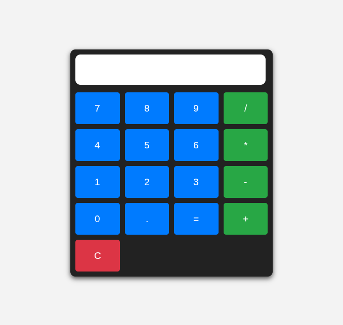

# Day 1 – Simple Calculator

## 📅 Date
June 23, 2025

## 📌 Challenge Goal

Build a **basic calculator** that performs simple arithmetic operations:  
➕ Addition, ➖ Subtraction, ✖️ Multiplication, and ➗ Division using HTML, CSS, and JavaScript.

## 🛠️ Tools Used

- HTML5  
- CSS3  
- JavaScript (ES6)

## 🎯 What I Learned

- How to handle button click events using JavaScript
- Basic DOM manipulation
- Using `eval()` carefully for mathematical operations
- Styling with responsive design in mind

## 📸 Preview

  
*(Replace this with an actual screenshot when available)*

## 🚀 Live Demo

🔗 [Live Demo](#) *(Add Netlify/Vercel/GitHub Pages link if deployed)*

## 📂 Project Structure
├── /Day01-Calculator
│ ├── index.html
│ ├── index.js
│ ├── style.css
│ └── README.md

