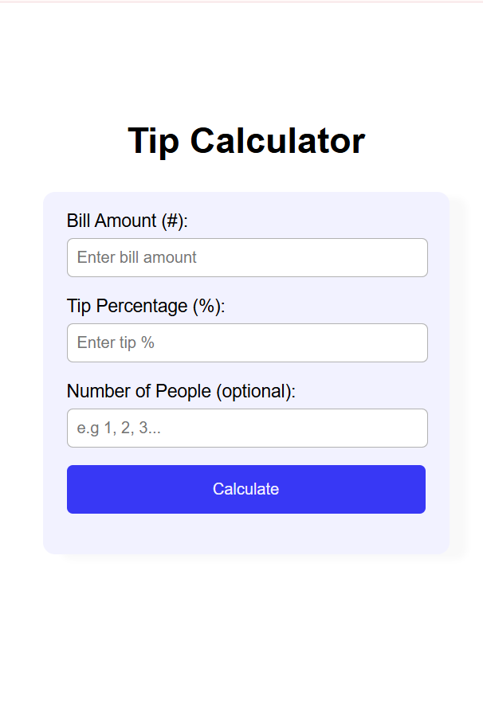

# Day 1 – Tip Calculator

## 📅 Date
June 26, 2025

## 📌 Challenge Goal

Build a **basic tip calculator** that performs simple arithmetic operations:  
➕ Addition, ➖ Subtraction, ✖️ Multiplication, and ➗ Division using HTML, CSS, and JavaScript.

## 🛠️ Tools Used

- HTML5  
- CSS3  
- JavaScript (ES6)

## 🎯 What I Learned

- How case sensitive JavaScript actuall is. Jeez!!!
- The importance of parseInt and parseFloat in this particular project: parseInt and parseFloat are JavaScript functions that help convert strings into numbers so my calculator can do correct math.
- How to debug for the first time. Took me hours to debug a simple tip Calculator , and the problem turned out to be a simple spelling error ffs.

## 📸 Preview

  

## 🚀 Live Demo

🔗 [Live Demo](#) *(Add Netlify/Vercel/GitHub Pages link if deployed)*

## 💡 Future Improvements

- Add animation
- improve responsiveness

---

**Progress:** ✅ Completed  
**Time Spent:** [7hours(thanks to a simple spelling error.)]  
**Mood:** 😎 [Motivated]

---

