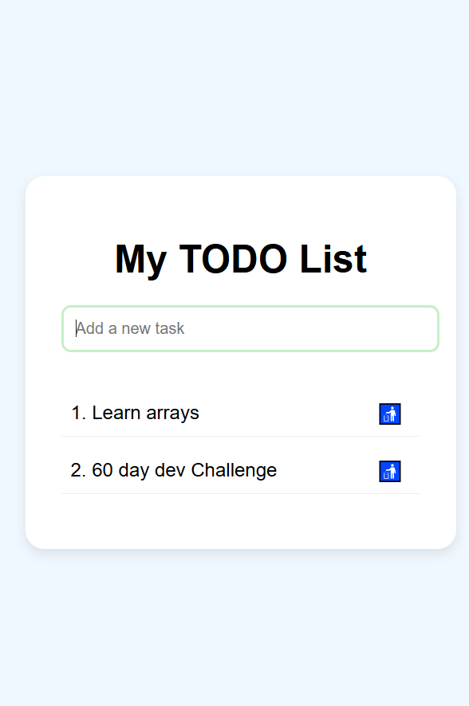

# Day 3 – TODO list 

## 📅 Date
June 27, 2025

## 📌 Challenge Goal

Build a **TODO List**  

## 🛠️ Tools Used

- HTML5  
- CSS3  
- JavaScript (ES6)

## 🎯 What I Learned

- How to use event listeners.
- How to create, update, and remove HTML elements using DOM.

## 📸 Preview

  

## 💡 Future Improvements

- Add local storage upgrade

---

**Progress:** ✅ Completed  
**Time Spent:** [2hours()]  
**Mood:** 😎 [Motivated]

---

