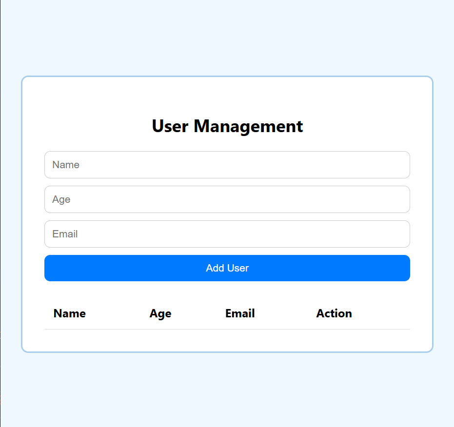

# Day 4 – User Management Dashboard 

## 📅 Date
June 28, 2025

## 📌 Challenge Goal

Build a **User Management Dashboard**  

## 🛠️ Tools Used

- HTML5  
- CSS3  
- JavaScript (ES6)

## 🎯 What I Learned

- How to grab input values from HTML.
- How to use .trim() to clean up input.
- Store and display data using arrays and objects.
- Add, showand delete users.

## 📸 Preview

  

## 💡 Future Improvements

- Add local storage upgrade

---

**Progress:** ✅ Completed  
**Time Spent:** [2hours10mins()]  
**Mood:** [Consistent]

---