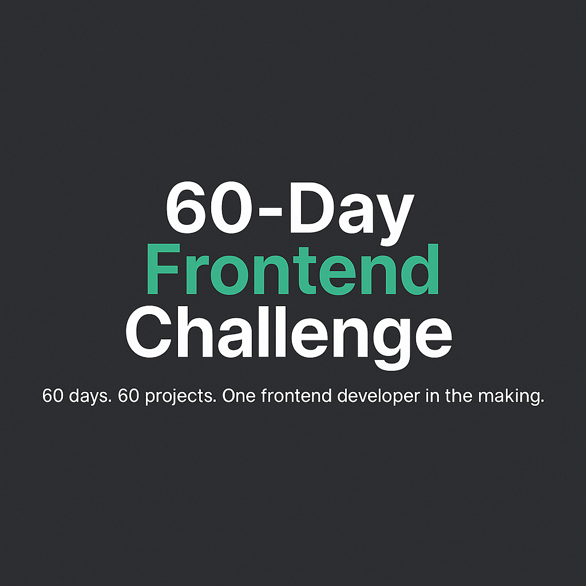

# 60-day-Frontend-challenge
60 days. 60 projects. One frontend developer in the making. Follow my journey as I build small but mighty projects daily using HTML, CSS, JavaScript, and React.

# 🚀 60-Day Frontend Development Challenge

> *"Consistency is the foundation of mastery — just show up every day."*  
> — Jay the Dev Dynamo

Welcome to my personal 60-day journey to becoming a **Frontend Developer**! This repository documents all the projects, practice exercises, and lessons I’ll be working on from **June 23, 2025**, to improve my skills and land a frontend development job.

---

## 📌 Objective

To build a solid portfolio and sharpen my skills in frontend development by completing focused projects and challenges for 60 total working days.

---

## 🧰 Tech Stack

- HTML5  
- CSS3 / Tailwind CSS  
- JavaScript (ES6+)  
- React.js  
- Next.js  
- Git & GitHub  
- Responsive & Mobile-First Design

---

## 📂 Folder Structure

Each day’s project will live in its own folder:

[Day 1 – Simple Calculator](./Day01-Calculator/)
[Day 2 – Tip Calculator](./Day02-tip-calculator/)
[Day 2 – Tip Calculator](./Day03-ToDo-list-app/)
[Day 2 – Tip Calculator](./Day04-User-management-dashboard/)

Each folder includes:
- `README.md` (short description)
- Source code (`.html`, `.css`, `.js`, etc.)
- Screenshots / Demos

---

## ✅ Progress Tracker

| Day | Project | Status |
|-----|---------|--------|
| 01  | Simple Calculator | ✅ |
| 02  | Tip Calculator | ✅ |
| 03  | TODO List | ✅ |
| 04  | User Management Dashboard | ✅ |
| 05  | Testimonial Slider | ⏳ |
| 06  | Blog Preview Page | ⏳ |
| 07  | JS Form Validation | ⏳ |
| ... | ... | ... |
| 60  | Final Portfolio Project | 🔜 |

---

## 📸 Daily Updates

I'll be posting short videos and updates to document my progress:

- 🐦 Twitter/X: [@jayTheDevDynamo](https://twitter.com/jayTheDevDynamo)  
- 🔗 LinkedIn: [Jay the Dev Dynamo](https://www.linkedin.com/in/jay-thedevdynamo)

---

## 🙌 Contributions

This is a personal learning journey, but you're welcome to:
- ⭐ Star the repo
- 🧠 Learn alongside me
- 📝 Drop feedback or ideas in the issues/discussions

---

## 🏁 Final Goal

To gain enough confidence, skills, and portfolio projects to land my **first frontend developer job** or internship by the end of this challenge.

---

**Let’s build something awesome — one day at a time.**